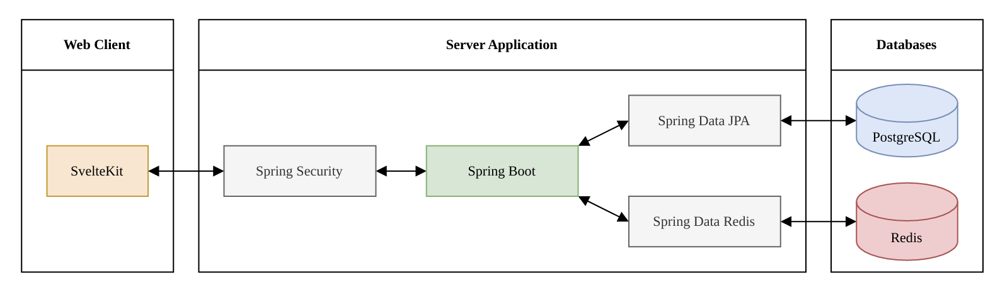
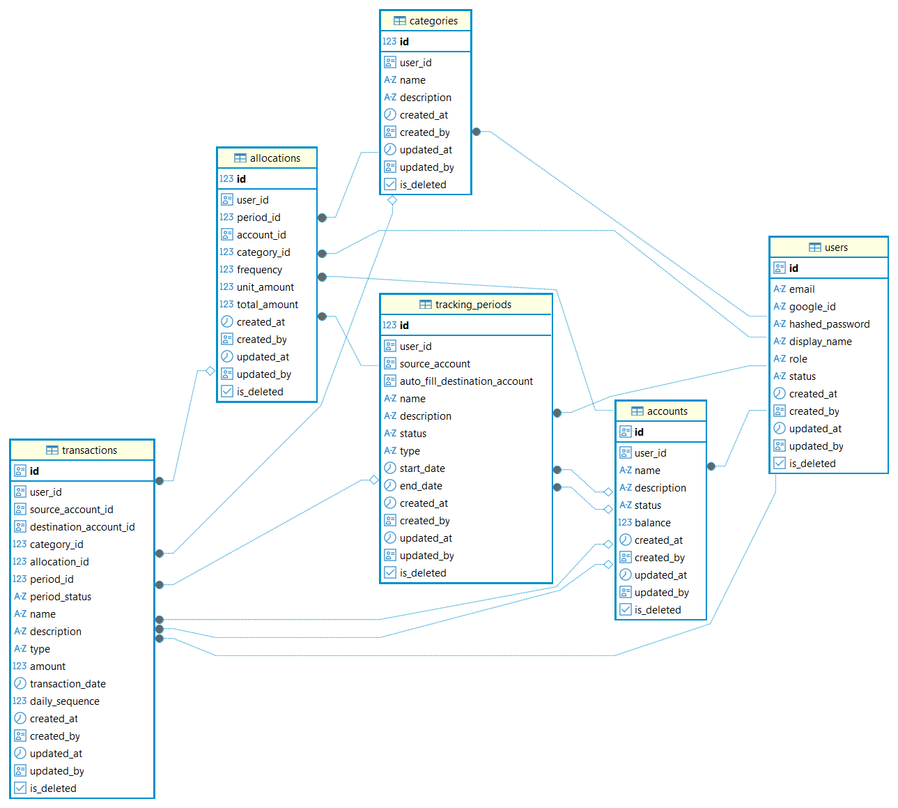

# MONOTE BE
> Repository for Monote server application

**Monote** is a web application for users to plan and track their personal expenses.
The main goal is to help user take full control of their financial health and achieve their savings goals.

### Core features:

- **Budget planning**: Create and customize financial plans (amount, spending purposes, financial sources) for a specific period.
- **Allocation suggestions**: Suggest transaction to allocate user money as the preparation for Expense tracking & Analytics. 
- **Expense tracking & Analytics**: Monitor user expenses across many dimension (spending purposes, financial sources) via statistical data and visual charts.

### Techniques for backend
- Java 26, Spring Boot 4
- PostgreSQL, Redis
- Docker, Flyway

### Architecture diagram


### Entity-relationship diagram


### API document
*Updating...*

### Getting started
1. Clone or download the repository.
2. Open the project in **IntelliJ IDEA**.
3. Wait for Gradle to automatically download dependencies.
4. Run the `MonoteBeApplication` class.

*If the **Run terminal** logs the below log, you are all set.*
```
||================================||
|| Monote BE started successfully ||
||================================||
```