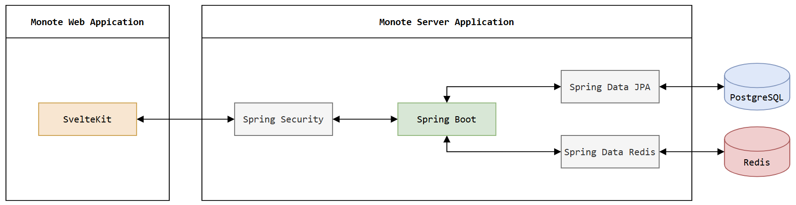
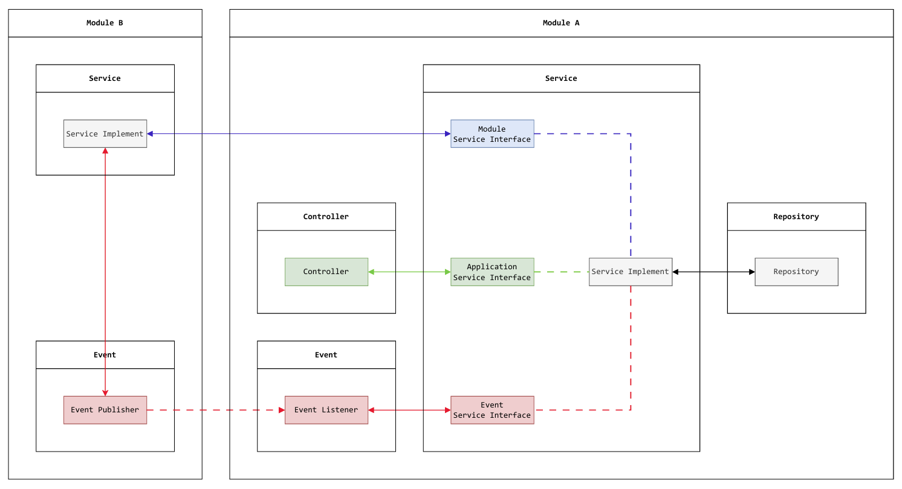

# MONOTE BE REPO
> Repository for Monote server application
>
> [`Monote FE repo`](https://github.com/yozakura-minato/monote-fe) [`Ticket board`](https://github.com/users/yozakura-minato/projects/4)

**Monote** is a web application for users to plan and track their personal expenses.
The main goal is to help user take full control of their financial health and achieve their savings goals.

### Core features

- **Budget planning**: Create and customize financial plans (amount, spending purposes, financial sources) for a specific period.
- **Allocation suggestions**: Suggest transaction to allocate user money as the preparation for Expense tracking & Analytics. 
- **Expense tracking & Analytics**: Monitor user expenses across many dimension (spending purposes, financial sources) via statistical data and visual charts.

### Techniques for backend
- Java 26, Spring Boot 4
- PostgreSQL, Redis
- Docker, Flyway

### System architecture diagram



### Entity-relationship diagram


### Project structure
```
monoteBe
├── security
├── common
├── persistence
└── module
    ├── domain
    │   ├── type
    │   │   └── Enum.java    
    │   └── Entity.java
    ├── repository
    │   ├── projection
    │   │   └── Projection.java    
    │   └── Repository.java
    ├── service
    │   ├── payload
    │   │   ├── Request.java
    │   │   └── Response.java    
    │   ├── implement
    │   │   └── ServiceImplement.java    
    │   ├── ApplicationService.java
    │   ├── ModuleService.java
    │   └── EventService.java
    ├── controller
    │   ├── payload
    │   │   ├── Request.java
    │   │   └── Response.java
    │   └── Controller.java
    ├── event
    │   ├── payload
    │   │   └── Event.java
    │   ├── EventListener.java
    │   └── EventPublisher.java
    └── shared
        ├── Mapper.java
        ├── Constant.java
        └── Message.java
```

### Getting started
1. Clone or download the repository.
2. Open the project in **IntelliJ IDEA**.
3. Wait for Gradle to automatically download dependencies.
4. Start **Docker Engine**.
5. Run the `MonoteBeApplication` class.

*If the **Run terminal** logs the below log, you are all set.*
```
||================================||
|| Monote BE started successfully ||
||================================||
```
6. **Monote Server Application** is now running at: `http://localhost:8080/`.